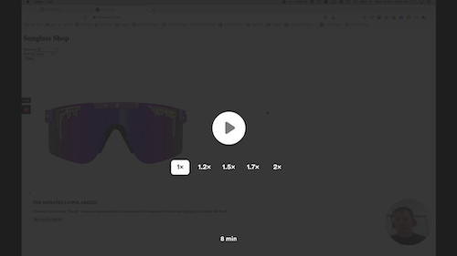
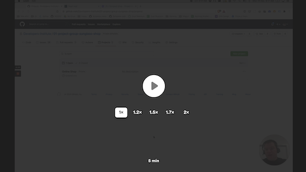

# 01 Project - Online Shop

## Assessment details

- [Level 5 Learning Outcomes](./docs/learning-outcomes-l5.md)
- [Level 6 Learning Outcomes](./docs/learning-outcomes-l6.md)

---

## Brief

You have been tasked with completing an eCommerce shop. You will need to set up the shop, create products and integrate your React Application with a third party platform. You also need to complete some new features for the online store.

## Project handover

Watch the following handover from another developer to your team. This video explains the codebase you will be working in, and where to find the files you will be working on.

<a href="https://www.loom.com/share/aa64e1d90bc14009b92965e159aa5b98">
  
  
Project code walkthrough (3 mins)

</a>

## Using GitHub projects

This project will be run using GitHub issues and projects. Watch the following tutorial to understand how to use GitHub projects and where to find the project tasks.

<a href="https://www.loom.com/share/e3240be203cf4be7858bba6d7c5ef958">
  
  
Using GitHub Projects (2 mins)

</a>

---

# Submit your Project

- [ ] Complete each GitHub issue one at a time
- [ ] Ensure to push all your changes to GitHub
- [ ] Submit your project in Google Classroom
