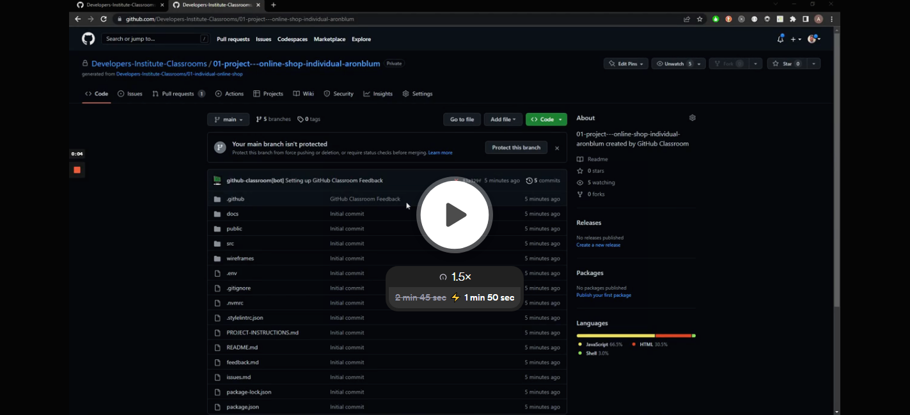

# 01 Project - Online Shop

## Assessment details

- [Level 5 Learning Outcomes](https://drive.google.com/file/d/1n0QoUTt1Kpd5kan3hpACKi_x34bxQOUP/view?usp=sharing)
- [Level 6 Learning Outcomes](https://drive.google.com/file/d/1lKVkEKaFKp_kafReBcypbwpSDpr9H8xC/view?usp=sharing)

---

## Brief

You have been tasked with completing an eCommerce shop. You will need to set up the shop, create products and integrate your React Application with a third party platform. You also need to complete some new features for the online store.

## Project handover

Watch the following handover from another developer to your team. This video explains the codebase you will be working in, and where to find the files you will be working on.

<a href="https://www.loom.com/share/aa64e1d90bc14009b92965e159aa5b98">
  
  
Project code walkthrough (3 mins)

</a>

## Kanban Board

Watch the following video on how to setup a Kanban Board in GitHub Projects, which you'll be using to track the tasks you need to complete for the project.

<a href="https://www.loom.com/share/1164ca178fcc4c0ab4ab5df1820a0119">
  
  
Kanban Board Walkthrough (3 mins)

</a>

## Using GitHub projects

You should have now setup your Kanban Board. Watch the following tutorial to understand how to use your board to track each of your tasks.

<a href="https://www.loom.com/share/e3240be203cf4be7858bba6d7c5ef958">
  
  
Using GitHub Projects (2 mins)

</a>

---

# Submit your Project

- [ ] Complete each GitHub issue one at a time
- [ ] Ensure to push all your changes to GitHub
- [ ] Deploy your application to Render
- [ ] Submit your project in iQualify
