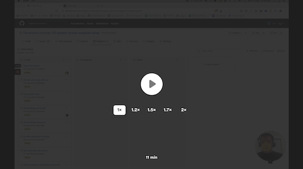

# 01 Project - Online Shop

## Assessment details

- [Level 5 Learning Outcomes](./docs/learning-outcomes-l5.md)
- [Level 6 Learning Outcomes](./docs/learning-outcomes-l6.md)
- [Marking criteria](./docs/marking-criteria.md)

---

## Brief

Your team has been tasked with completing an eCommerce shop. You will need to set up the shop, create products and integrate your React Application with a third party platform. You also need to complete some new features for the online store.

## Rationale

- Learn how to work in a team on the same product by following industry-standard development practices
- Apply the knowledge you have learnt so far to build a feature for an existing product

## Project handover

Watch the following handover from another developer to your team. This video explains the codebase you will be working in, and where to find the files you will be working on.

<a href="https://www.loom.com/share/e2b4b795b4c3493eb6638e1021b7fba7">
  
  <p>Project handover (8 mins)</p>
</a>

## Your development workflow

### Using GitHub projects

This project will be run using GitHub issues and projects. Watch the following tutorial to understand how to use GitHub projects and where to find the project tasks.

<a href="https://www.loom.com/share/5a8bc195d9cf47389aac6c82eb0d161d">
  
  <p>Using GitHub Projects (5 mins)</p>
</a>

### Development process

Follow the [GitHub Flow](https://guides.github.com/introduction/flow/) when working on this team project.

<a href="https://www.loom.com/share/33612f8d17b54bdaae55a9a3bd54d517">
  
  <p>The development lifecycle aka GitHub Flow (11 mins)</p>
</a>

### Performing a code review

A requirement for this project is that you give and receive a Code Review.

When you have prepared some code that is ready for review, share a [Pull Request](https://docs.github.com/en/free-pro-team@latest/github/collaborating-with-issues-and-pull-requests/proposing-changes-to-your-work-with-pull-requests) with your team and organise someone to review it for you.

---

# Submit your Project

- [ ] Complete each GitHub issue by creating a branch, pull request and merging to the main branch

---

<details>
  <summary>
    Git CLI Refresher
  </summary>

If you need help remembering what commands to type with `git`, use the following as a reference, or watch the [git walkthrough tutorial video](https://vimeo.com/433825571/bc1830fb90)

```shell
# when ready to commit and push
git add .

git commit -m "Completed Part A"

git push origin master
```

</details>
